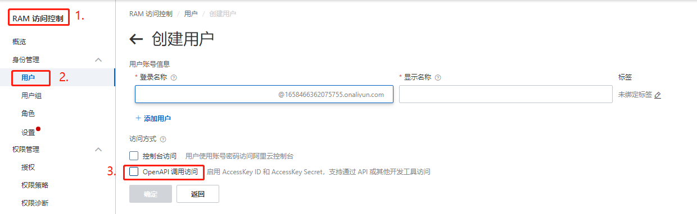
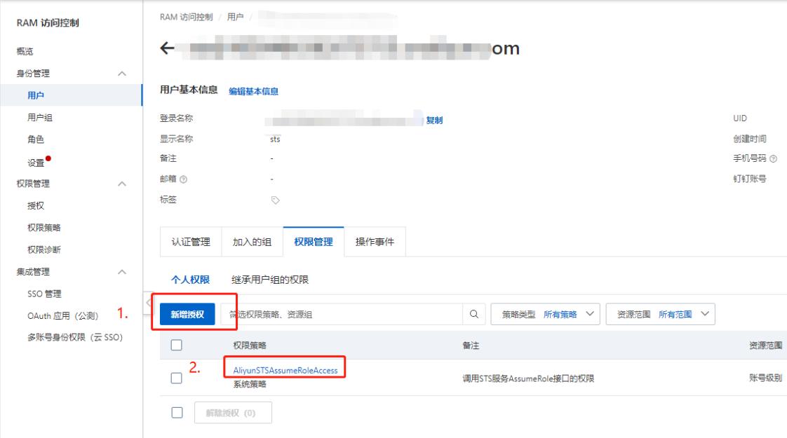
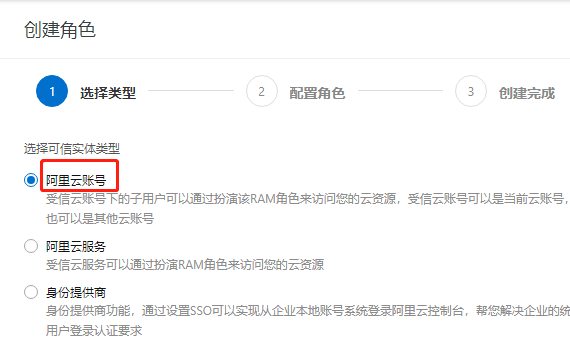
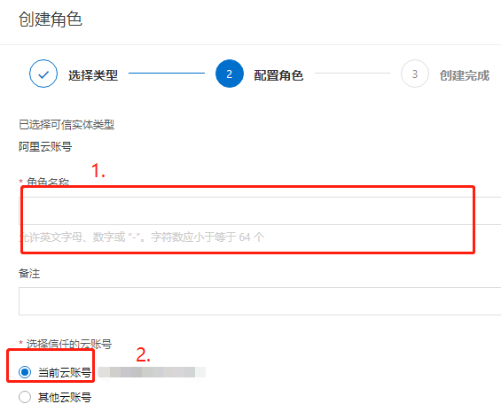
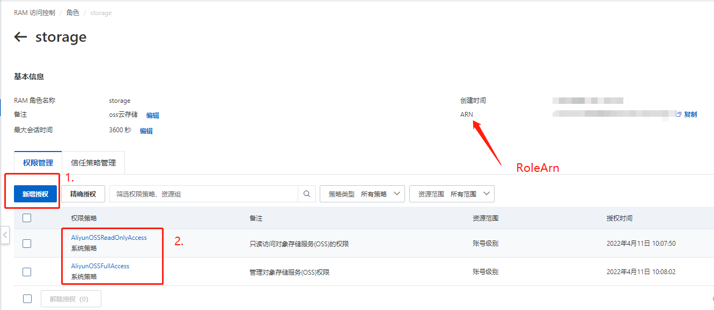
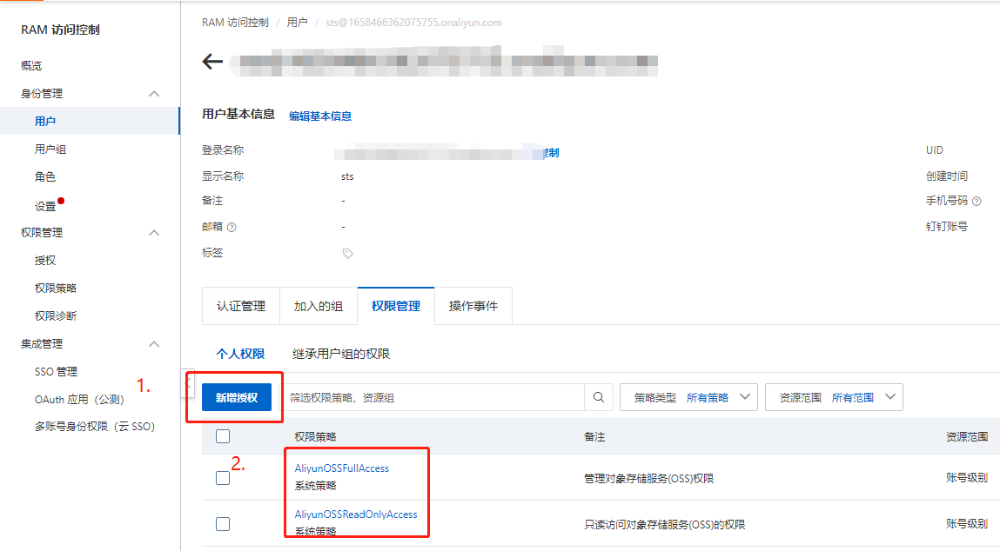
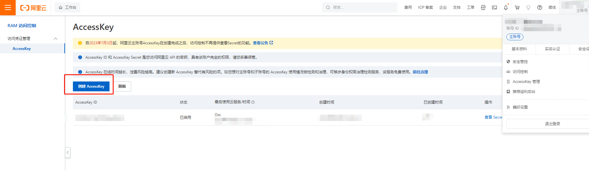

# 阿里云存储 OSS

提供了基础的对象存储功能，通过它可以极大减轻对接阿里云存储的工作量

## 使用

使用阿里云存储`SpeedBoot.ObjectStorage.Aliyun`分两种情况：

1. AspNetCore 项目（Web项目）使用
2. 非AspNetCore项目（非Web项目）使用

### 场景1：AspNetCore 项目

阿里云存储实现了模块自动加载，因此 **Web** 项目安装`SpeedBoot.AspNetCore`后按照约定配置即可，具体操作如下：

1. 安装 `SpeedBoot.AspNetCore`

   ```shell
   dotnet add package SpeedBoot.AspNetCore
   ```

2. 配置环境变量

   以开发环境为例，修改 **Properties/launchSettings.json**，线上环境请参考 [修改环境变量](https://learn.microsoft.com/zh-cn/aspnet/core/fundamentals/environments?view=aspnetcore-7.0#set-environment-on-the-command-line)

   ```json
   {
       "$schema":"https://json.schemastore.org/launchsettings.json",
       "profiles":{
           "WebApplication.Service":{
               "commandName":"Project",
               "dotnetRunMessages":true,
               "launchBrowser":true,
               "launchUrl":"swagger",
               "applicationUrl":"https://localhost:7124;http://localhost:5102",
               "environmentVariables":{
                   "ASPNETCORE_ENVIRONMENT":"Development",
                   "ASPNETCORE_HOSTINGSTARTUPASSEMBLIES":"SpeedBoot.AspNetCore"
               }
           }
       }
   }
   ```

   > 环境变量 ASPNETCORE_HOSTINGSTARTUPASSEMBLIES 的值为固定值：SpeedBoot.AspNetCore

   > 步骤1、2 属于 **AspNetCore** 项目共有，并非 **阿里云存储** 独享的功能

3. 安装 `SpeedBoot.ObjectStorage.Aliyun`

   ```shell
   dotnet add package SpeedBoot.ObjectStorage.Aliyun
   ```

4. 增加阿里云存储配置

   ```json
   {
     "AliyunObjectStorage": {
       "AccessKeyId": "AccessKeyId-storage",
       "AccessKeySecret": "AccessKeySecret-storage",
       "Endpoint": "Endpoint-storage",
       "CallbackUrl": "CallbackUrl-storage",
       "CallbackBody": "CallbackBody-storage",
       "EnableResumableUpload": true,
       "BigObjectContentLength": 100,
       "PartSize": 1024,
       "Quiet": true,
       "BucketName": "BucketName-storage"
     }
   }
   ```

5. 在项目中通过依赖注入获取 `IObjectStorageClient` 或 `IObjectStorageClientContainer` 使用即可

### 场景2：非 AspNetCore 项目

1. 安装 `SpeedBoot.ObjectStorage.Aliyun`

   ```shell
   SpeedBoot.ObjectStorage.Aliyun
   ```

2. 增加阿里云存储配置

   ```json
   {
     "AliyunObjectStorage": {
       "AccessKeyId": "AccessKeyId-storage",
       "AccessKeySecret": "AccessKeySecret-storage",
       "Endpoint": "Endpoint-storage",
       "CallbackUrl": "CallbackUrl-storage",
       "CallbackBody": "CallbackBody-storage",
       "EnableResumableUpload": true,
       "BigObjectContentLength": 100,
       "PartSize": 1024,
       "Quiet": true,
       "BucketName": "BucketName-storage"
     }
   }
   ```

3. 注册到服务集合

   ```csharp
   var services = new ServiceCollection();
   var file = "appsettings.json";
   var configuration = new ConfigurationBuilder()
       .SetBasePath(Directory.GetCurrentDirectory())
       .AddJsonFile(file)
       .Build();
   AppCore.ConfigureConfiguration(configuration);
   services.AddAliyunStorage();
   ```

   > 确保配置文件被复制到项目运行目录

4. 在项目中通过依赖注入获取 `IObjectStorageClient` 或 `IObjectStorageClientContainer` 使用即可

## 其它

### 阿里云存储配置

阿里云存储配置支持三种格式：

1. 通 RAM 角色使用 STS（临时凭证）

   ```json
   {
     "AliyunObjectStorage": {
       "AccessKeyId": "RAM用户（需包含调用sts权限）的AccessKeyId",
       "AccessKeySecret": "RAM用户（需包含调用sts权限）AccessKeySecret",
       "Endpoint": "oss-cn-shanghai.aliyuncs.com（域名地址）",
       "BucketName": "storage1-test",
       "Sts": {
         "RegionId": "shanghai（区域）",
         "RoleArn": "acs:ram::1658466362075755:role/storage-temp（角色Arn）",
         "RoleSessionName": "storage（临时Token的会话名称）"
       }
     }
   }
   ```

   > Endpoint：https://help.aliyun.com/document_detail/31837.html
   >
   > BucketName：使用 `IObjectStorageClientContainer` 的 BucketName 名

   1. 创建RAM用户

   2. 设置RAM用户权限（包含STS）

   3. 创建RAM角色

        

   4. 设置RAM角色权限

      

2. 通过 RAM 用户秘钥与密码

   ```json
   {
     "AliyunObjectStorage": {
       "AccessKeyId": "RAM用户（需包含Oss权限）的AccessKeyId",
       "AccessKeySecret": "RAM用户（需包含Oss权限）AccessKeySecret",
       "Endpoint": "oss-cn-shanghai.aliyuncs.com（域名地址）",
       "BucketName": "storage1-test"
     }
   }
   ```

   1. 创建RAM用户

   2. 设置RAM用户权限（包含OSS）

   3. 使用主账号账户秘钥与密码

      ```json
      {
        "AliyunObjectStorage": {
          "AccessKeyId": "主账户的AccessKeyId",
          "AccessKeySecret": "主账户的AccessKeySecret",
          "Endpoint": "oss-cn-shanghai.aliyuncs.com（域名地址）",
          "BucketName": "storage1-test"
        }
      }
      ```

      使用主账号的`AccessKeyId`、`AccessKeySecret`
      > 如果使用的是主账号的秘钥与密码，也可使用下面配置

      ```json
      {
          "Aliyun":{
              "AccessKeyId":"主账户的AccessKeyId",
              "AccessKeySecret":"主账户的AccessKeySecret"
          },
          "AliyunObjectStorage":{
              "Endpoint":"oss-cn-shanghai.aliyuncs.com（域名地址）",
              "BucketName":"storage1-test"
          }
      }
      ```
      
      > 主账号秘钥可应用于所有阿里云的产品，如果存储账号使用主账号，使用上述配置可减少重复的秘钥配置（但为安全起见，不建议使用主账号配置）
